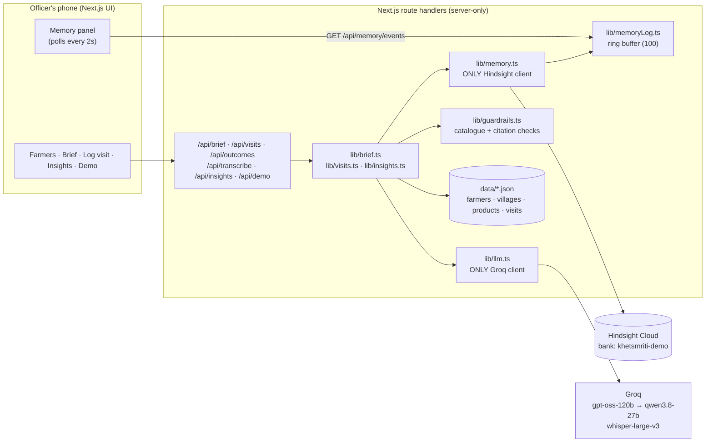
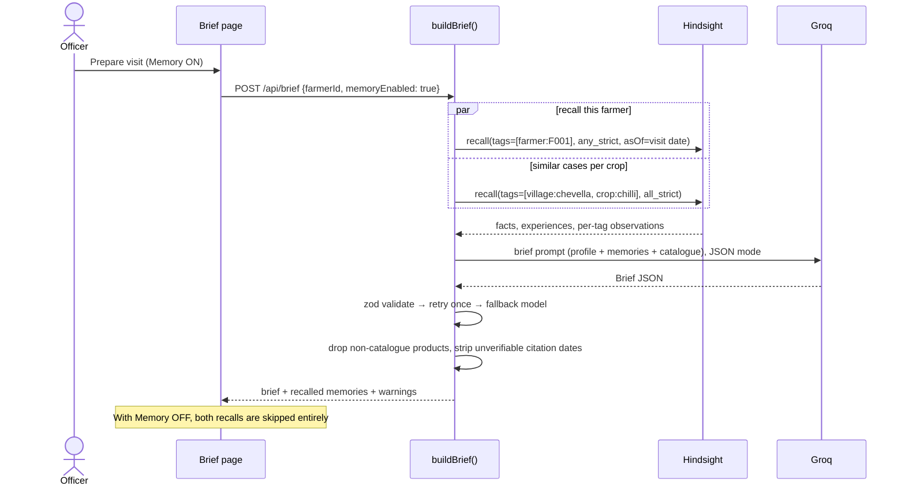
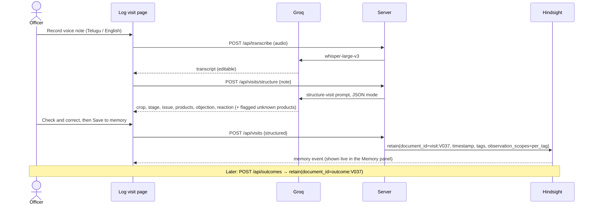

# KhetSmriti

> **A field officer who never forgets a farmer.** KhetSmriti remembers every visit, objection and
> crop outcome, and learns which advice works in each village.

KhetSmriti ("field memory") is an AI agent for field officers of agri-input distributors (seeds,
fertilisers, crop protection). Before a farmer visit it writes a **pre-visit brief** from everything
it remembers about that farmer. After the visit the officer speaks or types a short note, in Telugu
or English; the agent structures it and **retains** it. Over time it learns **which advice actually
works** for each farmer, village and crop.

Built with [Hindsight](https://hindsight.vectorize.io/) by Vectorize. Memory is the product: without
it, KhetSmriti is a generic chatbot, and the app lets you switch memory off to see exactly that.

---

## The problem

A field officer in Telangana covers dozens of farmers across several villages. Before each visit they
don't remember what they advised three months ago, whether the farmer refused it because of price,
or whether it worked. So the advice resets every visit:
- Premium products get pitched to price-sensitive farmers again and again.
- Pests that come back every August catch everyone by surprise.
- What worked for one farmer never reaches their neighbour.

The knowledge exists, spread across hundreds of conversations, but nobody can recall it at the moment
it matters.

## How it works in 60 seconds

1. **Prepare:** the officer opens Ramesh Goud's page. KhetSmriti **recalls** his visits and outcomes
   from Hindsight, plus similar cases from other chilli farmers in Chevella, and writes a brief. For
   example: *"Leaf blight is back. Recommend Blitox (₹420/acre), not Amistar Top. He refused Amistar
   on price on 8 Apr 2026 and lost about 20% yield. Show him Srinivas's plot result; that's what
   convinced him on 21 Apr."* Every claim shows the date of the visit it came from.
2. **Visit:** the officer talks to the farmer.
3. **Log:** the officer records a 30-second voice note in Telugu, English or a mix. Whisper
   transcribes it, an LLM turns it into a structured visit, the officer checks it, and KhetSmriti
   **retains** it with tags for the farmer, village, crop and officer.
4. **Follow up:** when the officer records the crop outcome, that is retained too, and this is what
   "learning" means here.
5. **Learn:** **reflect** answers questions such as *"What works for chilli blight in Chevella, and
   how should we handle price objections?"* over everything the village has seen.

A **Memory panel** on every screen shows each retain, recall and reflect live, with its tags and
latency.

## Architecture



### Pre-visit brief



### Post-visit log



## How KhetSmriti uses Hindsight

Every Hindsight call lives in [`src/lib/memory.ts`](src/lib/memory.ts). No other file imports the
client, and each call is timed and pushed to the memory event log that the UI shows.

### The bank: mission and directives

`npm run setup:bank` creates the `khetsmriti-demo` bank with a reflect mission (*"I am the field
memory of an agri-input distributor…"*), plus retain and observation missions that focus
extraction on products, objections and outcomes. It also syncs four **directives**, the hard rules
Hindsight enforces during reflect:

```ts
// src/lib/memory.ts — ensureBank() (idempotent: create missing directives, update changed ones)
const existing = await client().listDirectives(id, { limit: 100 });
for (const d of BANK_DIRECTIVES) {
  const match = existing.items.find((x) => x.name === d.name);
  if (!match) {
    await client().createDirective(id, d.name, d.content);
  } else if (match.content !== d.content || match.is_active === false) {
    await client().updateDirective(id, match.id, { content: d.content, isActive: true });
  }
}
```

The directives: only recommend catalogue products; never state a dosage that isn't in the catalogue;
always cite the visit date behind a claim; say so plainly when there is no history.

### Tag scheme

| Tag | Example | Used for |
|---|---|---|
| `farmer:<id>` | `farmer:F001` | everything about one farmer |
| `village:<slug>` | `village:chevella` | village-level patterns, reflect |
| `crop:<slug>` | `crop:chilli` | similar cases across farmers |
| `officer:<id>` | `officer:O01` | who gave the advice |
| `kind:visit` \| `kind:outcome` | `kind:outcome` | separating advice from results |

### Retain: one document per visit, one per outcome

The narrative content is plain English built from the structured visit
([`src/lib/narrative.ts`](src/lib/narrative.ts)), for example: *"Field visit on 2026-04-08 to Ramesh
Goud (F001) in Chevella… Advised Amistar Top (P006, premium tier, ₹1,480 per 500 ml…). Farmer
objected: price too high…"*.

```ts
// src/lib/memory.ts
export function visitMemoryItem(visit, farmer, village, catalogue): MemoryItemInput {
  return {
    content: buildVisitNarrative(visit, farmer, village, catalogue),
    document_id: visitDocumentId(visit.id),    // "visit:V002": re-seeding replaces, never duplicates
    timestamp: isoTimestamp(visit.date),       // the real visit date, so temporal recall works
    context: "field visit",                    // "crop outcome follow-up" for outcomes
    metadata: memoryMetadata(visit, village),  // { farmerId, visitId, village, crop, officerId }
    tags: visitTags(visit, village),           // farmer:, village:, crop:, officer:, kind:
    observation_scopes: "per_tag",
  };
}
```

**Why `per_tag` observation scopes?** Each retained memory feeds a separate consolidated observation
for each of its tags. So Hindsight builds a growing picture of **Ramesh** (`farmer:F001`: *rejects
premium on price, accepts when shown a neighbour's result*), of **Chevella** (`village:chevella`:
*copper fungicide controls chilli blight*), and of **chilli** across villages. With the default
`combined` scope, the observation would be tied to the exact tag combination of each visit and
would never add up across visits.

### Recall: this farmer, and similar cases

```ts
// src/lib/memory.ts — memories tagged with BOTH the village and the crop, excluding untagged ones
export async function recallSimilar(villageSlug, cropSlug, query, asOf?) {
  return recallTagged({
    tags: [tag.village(villageSlug), tag.crop(cropSlug)],
    tagsMatch: "all_strict",
    query,
    label: `recall similar ${villageSlug}/${cropSlug}`,
    asOf,
  });
}
```

`recallFarmer` does the same with `farmer:<id>` and `any_strict`. Both ask for
`types: ['world','experience','observation']` with `budget: 'mid'`. The `asOf` date is sent as
Hindsight's `queryTimestamp` for recency scoring, and any memory dated after it is dropped, so a
brief for 8 April can never "remember" July.

### Reflect: what works in this village

```ts
// src/lib/memory.ts
client().reflect(bankId(), question, { budget: "mid", tags, tagsMatch: "any_strict", includeFacts: true, signal })
```

The Insights screen asks three fixed questions per village and crop: what works for the top
problem, how to handle objections, and what to watch next month. It shows the answers with the
memories they were based on. On the seed data, reflect finds, without being told, that pink
bollworm returns to Moinabad cotton every August, and that Chevella farmers accept advice when it
comes with a neighbour's yield result.

### Memory OFF: the honest "before"

The Memory toggle on the brief page, and the side-by-side on `/demo`, call the same endpoint with
`memoryEnabled: false`. `buildBrief` then **skips both recalls entirely** and tells the model there is
no history. Nothing is faked: the difference you see comes only from Hindsight. Samples are in
[`docs/brief-samples.md`](docs/brief-samples.md). Without memory the brief suggests four generic
budget products with "no prior visit data". With memory it recommends the copper fungicide that
worked on his own field, cites the dates, and pitches around his known price objection.

## Guardrails

- **Catalogue only:** product ids from the LLM are checked against `data/products.json`, and unknown
  ids are dropped and shown as a warning.
- **Citations must be real:** a claim's `sourceVisitDate` must match a recalled memory, otherwise
  the date is removed and flagged.
- **Validated LLM output:** zod checks every LLM response. On failure it retries once with the error,
  then falls back to `qwen/qwen3.8-27b`, then returns a typed error. A page never crashes on an
  LLM error.
- **Server-only secrets:** Hindsight and Groq code is marked `server-only`, and a scan of the client
  bundle finds no keys or SDKs. Every route validates input with zod, and the AI routes are rate
  limited.

## Demo data

`/data` holds **simulated** field data for a distributor in Ranga Reddy district, Telangana:
- 3 villages (Chevella, Moinabad, Shabad)
- a catalogue of 15 products
- 8 farmers
- 36 visits and 30 crop outcomes from April to September 2026

The history seeds patterns for the agent to find:
- **a)** Chevella chilli blight: the premium fungicide was rejected or failed twice, while copper
  controlled it 4 times out of 5.
- **b)** Chevella accepts advice framed with yield data: 5 of 5 accepted, against 4 of 9 for a
  plain product pitch.
- **c)** Moinabad pink bollworm returns every August.
- **d)** Ramesh's own history: premium rejected on price with about 20% loss, then copper working.

`npm run validate:data` checks every reference and prints the patterns.

## Setup

Requirements: Node 20+, a [Hindsight Cloud](https://ui.hindsight.vectorize.io) API key, and a
[Groq](https://groq.com) API key.

```bash
npm install
cp .env.example .env.local     # fill in the values below
npm run setup:bank             # create/update the bank, mission and directives (safe to re-run)
npm run seed:memory            # retain 36 visits + 30 outcomes with their real dates (safe to re-run)
npm run smoke:memory           # optional: recall F001 + reflect on Chevella from the terminal
npm run dev                    # http://localhost:3000
```

| Variable | Value |
|---|---|
| `HINDSIGHT_BASE_URL` | from the Hindsight Cloud dashboard, e.g. `https://api.hindsight.vectorize.io` |
| `HINDSIGHT_API_KEY` | Hindsight Cloud API key (sent as a Bearer token by the SDK) |
| `HINDSIGHT_BANK_ID` | `khetsmriti-demo` |
| `GROQ_API_KEY` | Groq API key |
| `GROQ_MODEL_PRIMARY` | `openai/gpt-oss-120b` |
| `GROQ_MODEL_FALLBACK` | `qwen/qwen3.8-27b` |

Other scripts: `npm test`, `npm run test:coverage`, `npm run lint`, `npm run build`, and
`npm run forget:docs -- visit:V037` to delete test documents.

## Screens

The app is designed for phones first and works at 380px width. Screenshots go in
[`docs/screenshots/`](docs/screenshots/).

| Route | What it does |
|---|---|
| `/` | Farmers: search, a village filter, the last visit date, "Prepare visit" |
| `/farmers/[id]` | Pre-visit brief: Memory ON/OFF toggle, products with dated evidence, pitch, checks, cited claims, recalled memories, visit records with "Record outcome" |
| `/farmers/[id]/log` | Log a visit: voice (max 2 minutes) or typed, editable transcript, structured review, "Save to memory" |
| `/insights` | Village and crop: three reflect answers with their source memories |
| `/demo` | Memory OFF vs ON side by side, replay of Ramesh's history visit by visit, learning curve, reset |

## Project layout

```
src/app           routes and API route handlers
src/components    UI (brief/, log/, demo/, MemoryPanel, ui primitives)
src/lib           memory.ts (Hindsight) · llm.ts (Groq) · brief · visits · insights · guardrails · data
src/prompts       prompt templates (brief, structureVisit)
src/types         shared domain types
data/             JSON data (runtime visits go to data/visits.runtime.json, git-ignored)
scripts/          setup-bank, seed-memory, smoke-memory, validate-data, forget-docs
tests/            vitest unit tests
```

## Links

- Hindsight on GitHub: https://github.com/vectorize-io/hindsight
- Hindsight docs: https://hindsight.vectorize.io/
- What is agent memory? https://vectorize.io/what-is-agent-memory

## Author

Jeevitha Nanepalli
